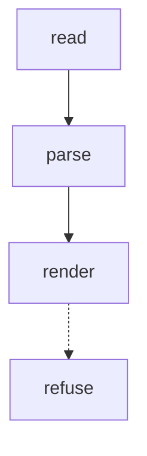

# Contract — five-verify · v1

facets: library
schema-touching: no

## Goal & scope
A fixture goal for five-verify, long enough to be a real sentence that the renderer must carry whole.

## Scope ladder
- NOW: the thing that ships
- NOW: a second thing that ships
- LATER: a deferred thing
- NEVER: a rejected thing

## Acceptance & INVARIANTs
- **INV-FIX:** the fixture asserts something. → *assert:* a command.

## Logic Map

