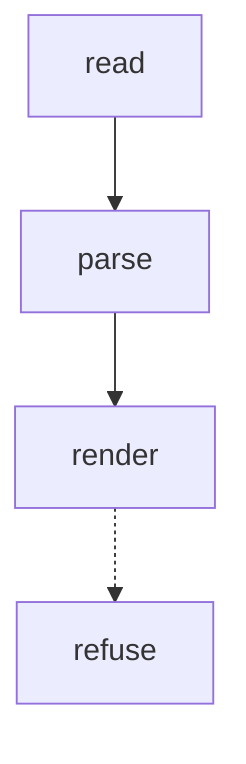

# Contract — twenty-steps · v1

facets: library
schema-touching: no

## Goal & scope
A fixture goal for twenty-steps, long enough to be a real sentence that the renderer must carry whole.

## Acceptance & INVARIANTs
- **INV-FIX:** the fixture asserts something. → *assert:* a command.

## Logic Map

