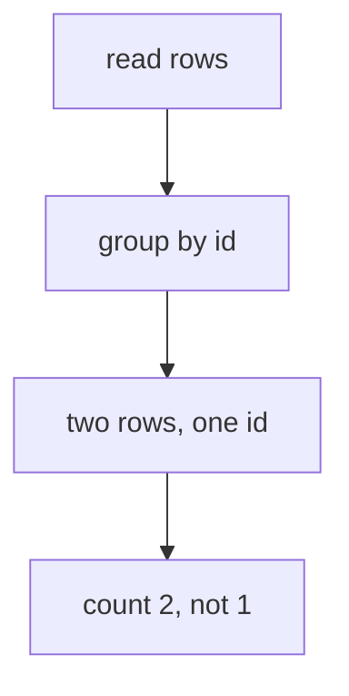

# Contract — dup-ids · v1

facets: library
schema-touching: no

## Goal & scope
**Goal:** two ledger rows share one finding id, and the long-field shapes fire every fieldText path.

Two rows sharing an id are TWO findings, not one. The byte-locked defeat corpus settled that, and a
dedupe rule that collapses them under-reports what is still open.

A third paragraph so the drop is unambiguous.

### NOW
1. Share an id across two rows.
2. Keep the fields long enough to shorten.

### NEVER
1. Collapse the duplicates. That was the wrong rule.

## Acceptance & INVARIANTs
- **INV-DUP:** two rows sharing an id are counted as two. → *assert:* the row count is 2.

## Evidence
Sources consulted:
- the byte-locked defeat corpus
- the round-one reviewer note
- the round-two reviewer note
- the delta reviewer note
- the consolidator note
- the re-measurement on a clean tree
- a seventh line the six-line cap discards
- an eighth line, likewise

## Reconciliation
Gold figures (literal, pinned):
- rows a reader cannot finish: 0
- destroying events over the fixture corpus: measured, not asserted
- settled rows dropped by the slice: measured
- scope items dropped past the sixth: measured
- bullets dropped past the eighth: measured
- paragraphs dropped after the first: measured
- a seventh figure, which the six-line cap discards with no marker at all
- an eighth figure, likewise discarded

## Logic Map

