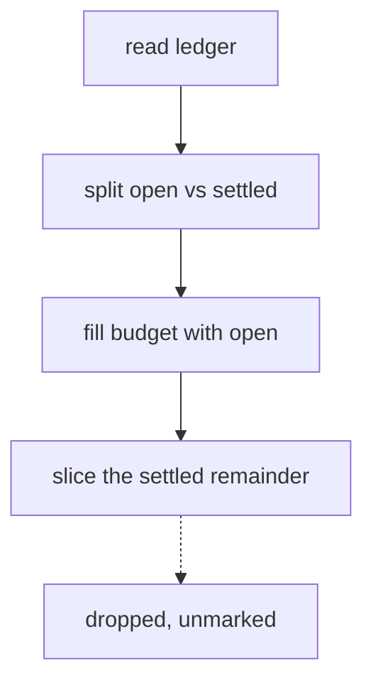

# Contract — long-ledger · v1

facets: library
schema-touching: no

## Goal & scope
**Goal:** a build whose review ledger is long enough that the renderer drops whole settled rows.

This section deliberately carries a SECOND paragraph. `firstPara()` returns paragraph one and
discards every paragraph after it, printing nothing at all to say it did — so a fixture with only
one paragraph would leave that path untested while the check stayed green.

And a third, for the same reason.

### NOW
1. Render a ledger with more rows than the view will show.
2. Drop settled rows once the open ones fill the budget.
3. Carry a field long enough to trip the sentence-boundary cut.
4. Carry a field with no sentence boundary at all, to trip the hard cut.
5. Carry a semicolon-separated list longer than the field budget.
6. Keep a second paragraph in at least one section.
7. Keep a bullet list with more than one bullet.
8. Exceed six NOW items, so the scope list itself is shortened.
9. Exceed them by enough that the count is unambiguous.

### LATER
1. Nothing here.

### NEVER
1. Become the live corpus. This is a regression fixture, not a gold.

## Acceptance & INVARIANTs
- **INV-LEDGER-CUT:** whole settled rows are dropped once the shown budget fills. → *assert:* `closedRows.slice` fires.
- **INV-SCOPE-CUT:** scope items past the sixth are dropped. → *assert:* `nowItems.slice6` fires.

## Notes
Evidence, in the shape that trips the six-line cap:
- line one of the evidence
- line two of the evidence
- line three of the evidence
- line four of the evidence
- line five of the evidence
- line six of the evidence
- line seven, which the six-line cap discards with no marker
- line eight, likewise

## Logic Map

