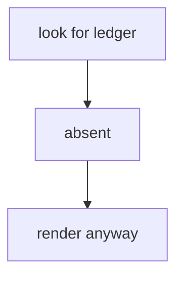

# Contract — no-ledger · v1

facets: library
schema-touching: no

## Goal & scope
**Goal:** a build with no review ledger at all, so the review view has to render from nothing.

A second paragraph, because a section with one paragraph leaves `firstPara()` untested.

## Acceptance & INVARIANTs
- **INV-NO-LEDGER:** the review view renders without a ledger file. → *assert:* exit 0.

## Logic Map

