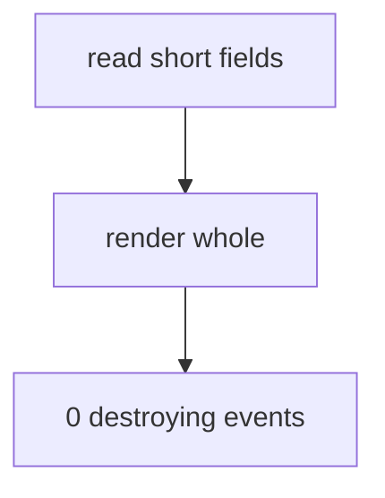

# Contract — short · v1

facets: library
schema-touching: no

## Goal & scope
**Goal:** the control fixture — short fields everywhere, so the destroying paths have nothing to destroy.

### NOW
1. Keep every field under the shortening threshold.
2. Give the check something that must measure zero.

### LATER
1. Nothing.

### NEVER
1. Grow. A control that grows stops being a control.

## Acceptance & INVARIANTs
- **INV-SHORT:** no destroying path fires on this fixture. → *assert:* the instrument reports 0 events for this dir.

## Logic Map

