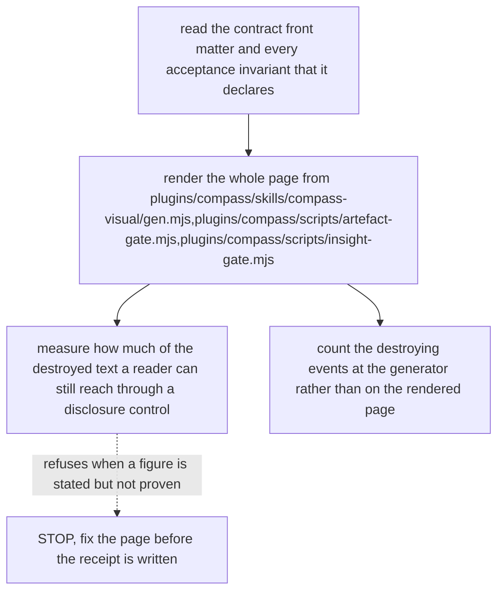

# Contract — long-boxes · v1

facets: library
schema-touching: no

## Goal & scope
**Goal:** the SVG fixture — box labels long enough that the diagram must shorten them, so the three S7c assertions have something to measure. Without it they score 0 over 0 and pass on an empty set.

### NOW
1. Carry a Logic Map whose node labels exceed the 30-character lead, so every box emits a sub-label.
2. Include one label whose remainder has no break point, so the hard-cut guard fires rather than the soft one.

### LATER
1. Nothing.

### NEVER
1. Shorten these labels. Short labels are what made the assertions vacuous.

## Acceptance & INVARIANTs
- **INV-SUBLABEL:** every box in this diagram emits a sub-label. → *assert:* the page carries more than one `font-size="11"` text element.
- **INV-PERBOX:** each sub-label has its own control beneath the diagram. → *assert:* rows and controls are equal and both above zero.

## Logic Map

